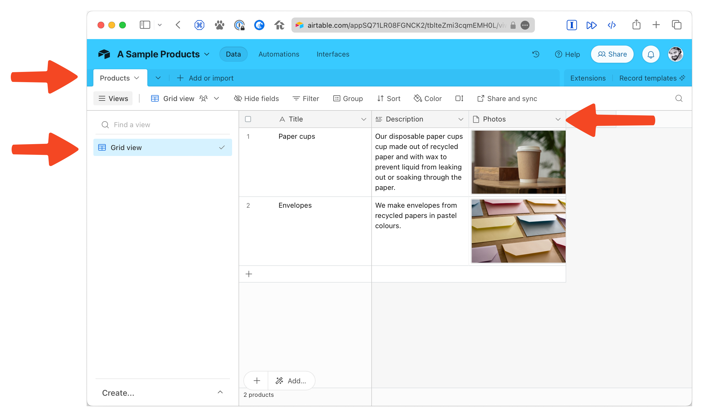

# Eleventy + Airtable

This sample project fetches data from an Airtable database.

Here is screenshot of the sample database on Airtable.



## Development

```sh
npm install
npm run dev # To run development Eleventy server

npm run build # Or, to run build
```
